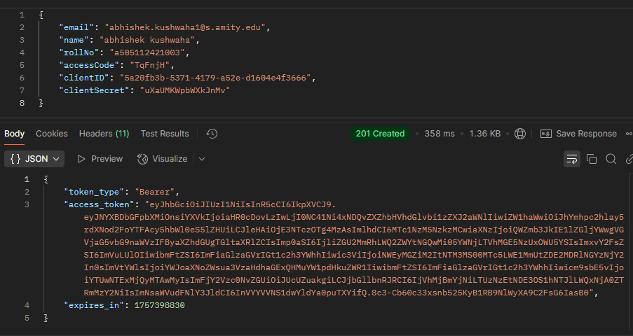

## Round-1 (Full Stack Developer)

### This Repository Contains the solution I submitted for the given problem statement

### In this problem, I used Golang for the backend and React for the frontend.

### Running the Backend

1. Move to the Backend: `cd backend-test-submission`
2. `go run main.go` to start the server.
3. Server runs at: `http://localhost:8080`
4. Use Postman to hit the endpoints.

### Running the Frontend:

1. Move to the Frontend: `cd frontend-test-submission`
2. Run `bun install` to install dependencies.
3. Run `bun run dev` to start the dev server.
4. The application will be accessible at `http://localhost:3000`.

### Screenshots:

## Thank you for giving me this opportunity to showcase my skills, and I look forward to hearing from you.
